#### diff_flat_ws
# Differential Flatness with LQR control implementation on multirotor in ROS Gazebo

### Instructions

To use repository,
```
git clone https://github.com/jacobmoroni/diff_flat_ws.git &&
cd diff_flat_ws &&
git submodule update --init --recursive &&
catkin_make &&
source devel/setup.bash
```
To run simulation
for LQR and feed forward control:
`roslaunch differential_flatness lqr_ff.launch`

For PID and feed forward control:
`roslaunch differential_flatness pid_ff.launch`

For feed forward control only, no feedback control:
`roslaunch differential_flatness ff_only.launch`

For PID only, no feed forward term:
`roslaunch differential_flatness lqr_ff.launch control_type:=o`

To only show states plotter not gazebo for any of the above commands, just add `visualize:=false` to the end.
___
### Differential Flatness derivation and Explanation
mostly derived from paper
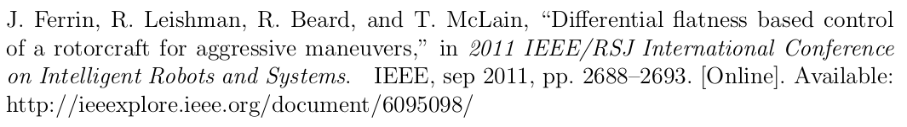

Background
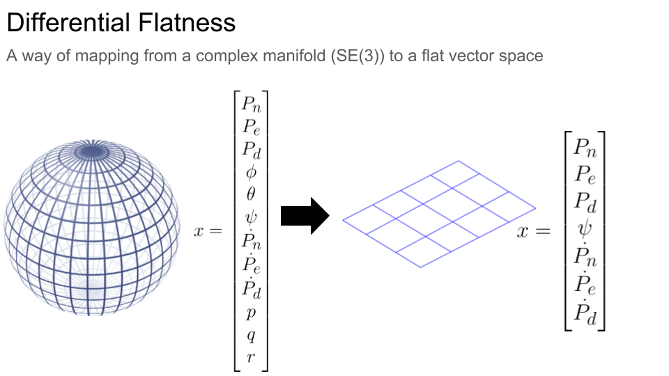
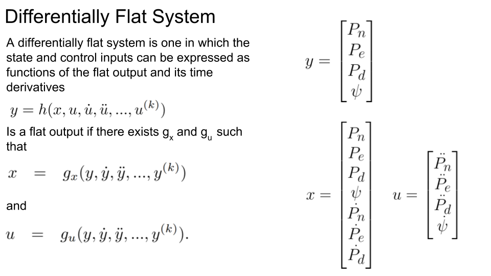

Block Diagram for differential flatness control
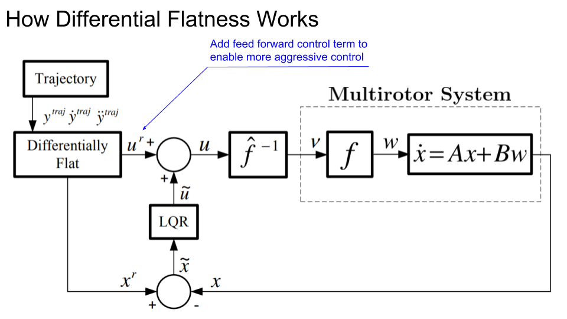

The following is the explanations of the blocks in the block diagram:

TRAJECTORY:
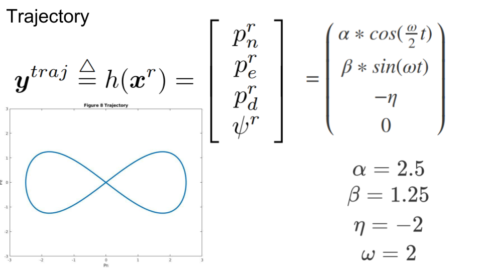


DIFFERENTIALLY FLAT:
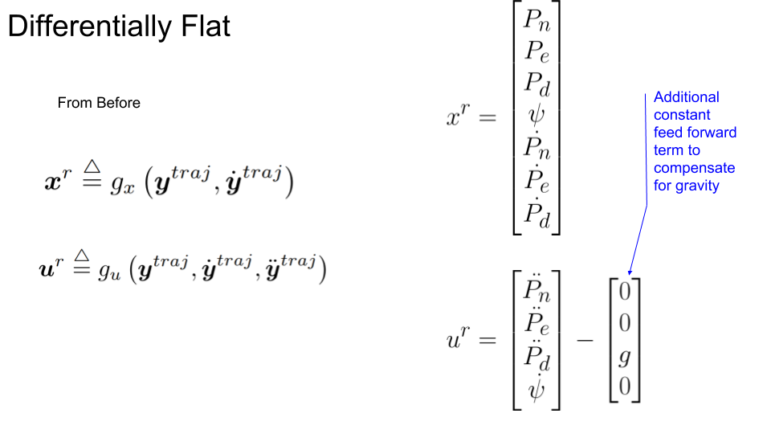

LQR:
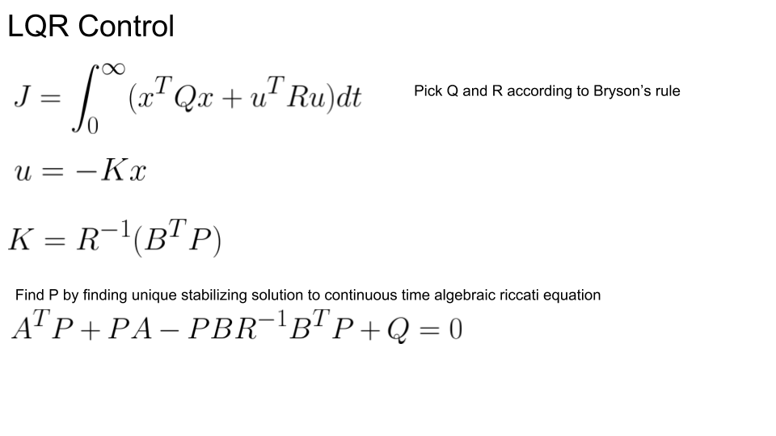
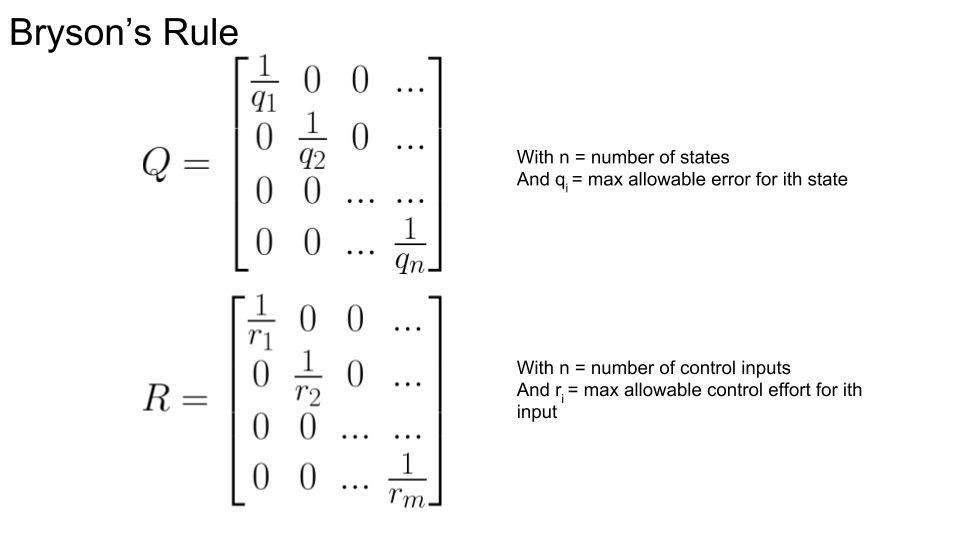
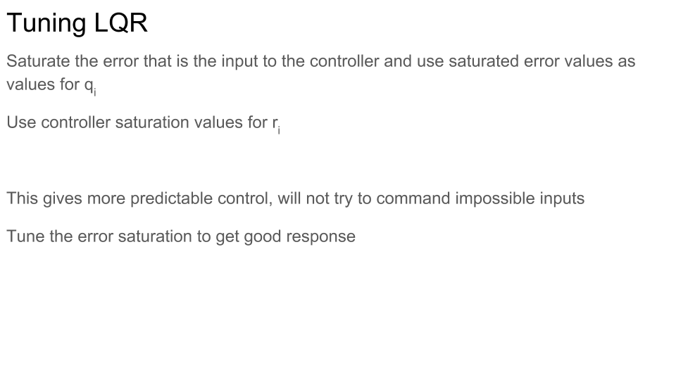

F and F inverse:
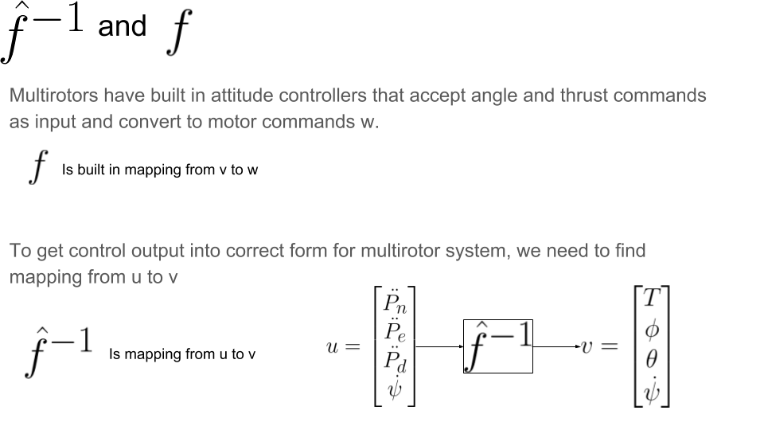
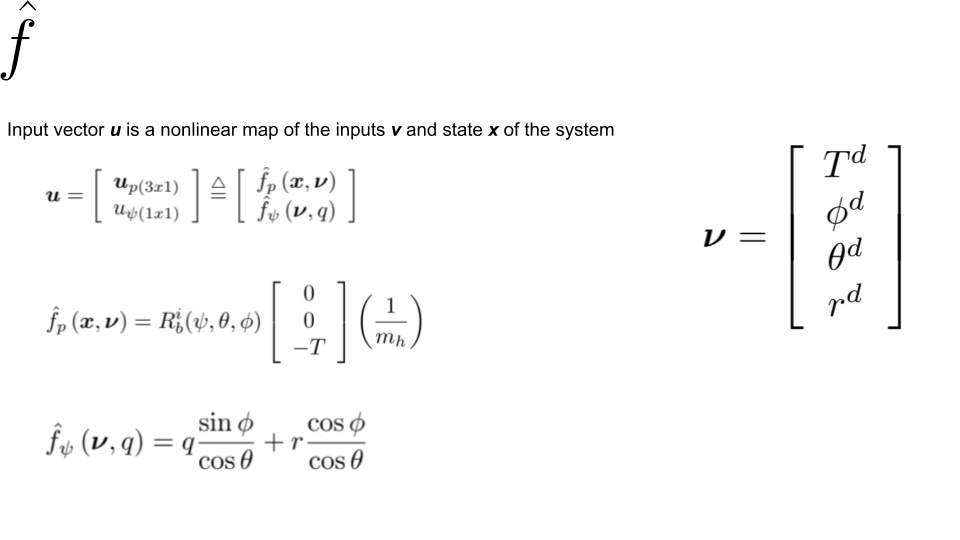
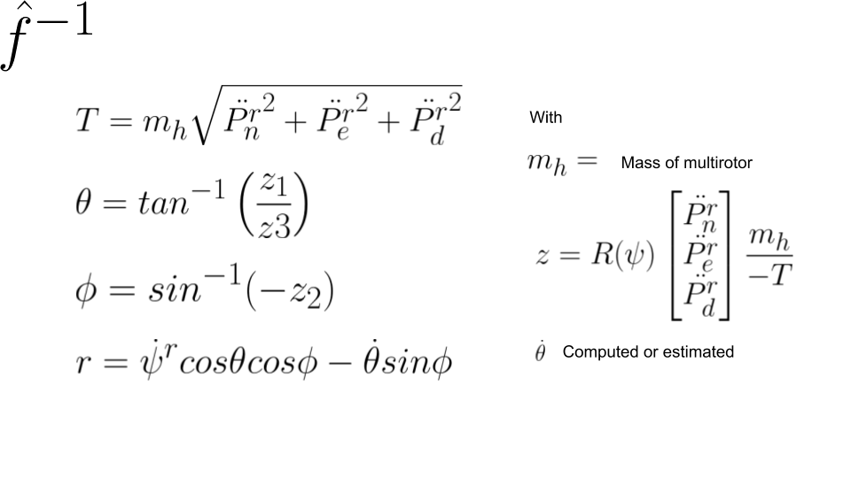

Assumptions of Differential Flatness and remedies to minimize issues from them.

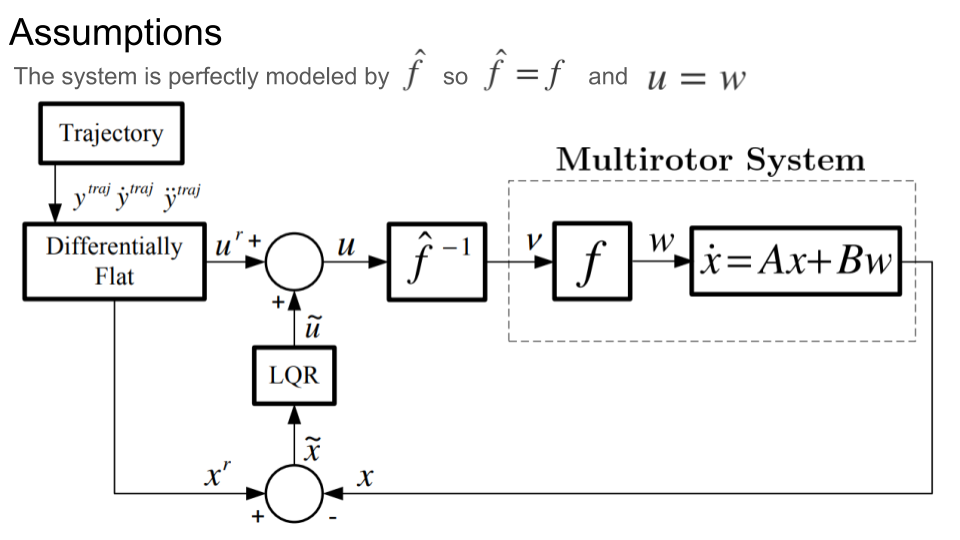
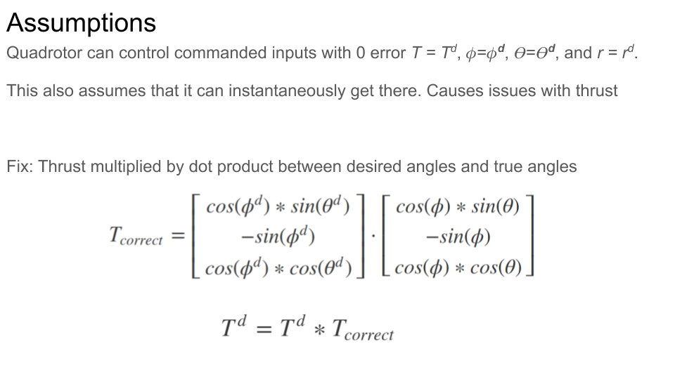
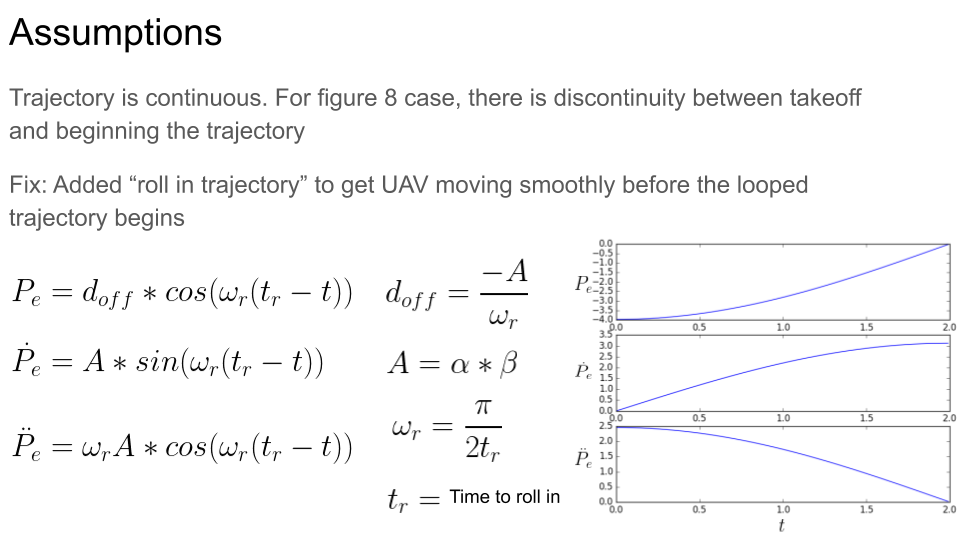

Modified Block Diagram for PID control
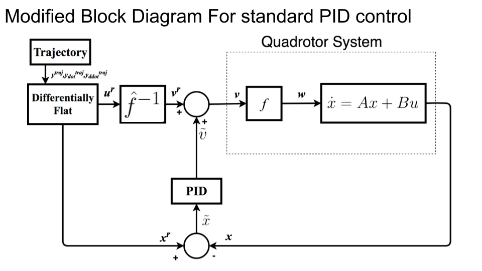

___
### Source Code Information
`traj.py` generates the trajectory and outputs derivatives of the trajectory to be used by controllers

`LQR.py` Solves for K gain by solving algebraic riccati equation, then computes control on error state and adds in feed forward control

`inverse.py` Performs f inverse mapping to convert control from accelerations and yawrate to angle thrust and yawrate

`attitude_control.py` Adds the thrust compensation to keep discussed in assumptions section

`states_plotter.py` plots desired and actual states during flight

`df_controller.cpp` PID controller used to get multirotor into position before trajectroy begins, then passes control from inverse directly through to multirotor

`controller_old.cpp` PID controller used for PID feed forward used in `pid_ff.launch` tuned better for differential flatness control

`multirotor.yaml` parameter file for multirotor
